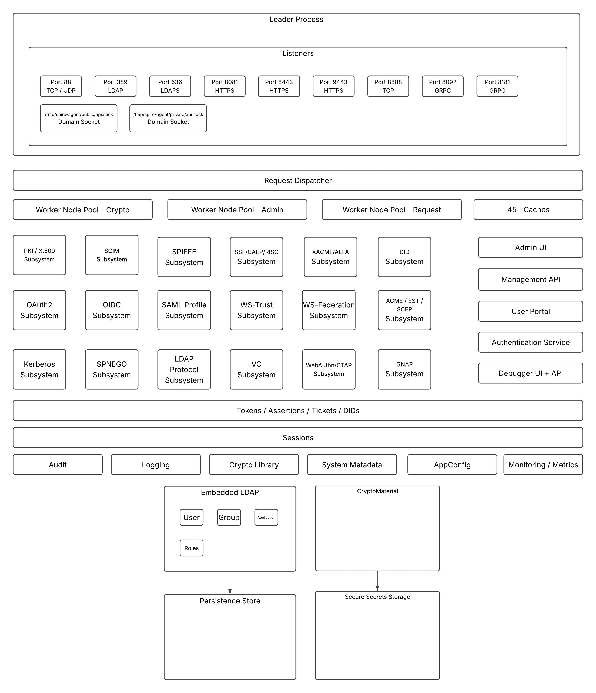

<p align="center"></p>

# iya-sts

An **identity provider and security token service** that speaks the protocol
families below from one process, with a certificate authority of its own.

It started as the mock STS inside the [OAuth2/OIDC Debugger](https://idptools.com)
project's test suite, and it runs in one of two modes, per trust realm
(`global.mode`):

* **`development`** (the default) is that mock: any username signs in, anything
  named is created, signing keys are regenerated on every start and test
  controls are open. Use it to exercise clients. **Never use it to protect
  anything.**
* **`product`** runs the same protocol implementations with the permissiveness
  taken out: passwords are verified against the directory, responses go only to
  registered addresses, there is no demonstration data, keys persist sealed
  under a key-encryption key, and several containers can share one PostgreSQL
  store.

`GET /admin/mode` says, for the running realm, exactly what each mode does.
Product mode is still being hardened; read the product-mode notes on a
protocol's documentation page before relying on it.

**The documentation is at [`docs/`](docs/index.md)** (published as a GitHub
Pages site): configuration, architecture, and a page per protocol family.

## Architecture

[](docs/iya-sts-architecture.jpeg)

One leader process owns every listener, and a request dispatcher hands work to
three worker pools (crypto, admin and request). The protocol subsystems share
one session model and one set of services over the embedded directory and the
key material. [`docs/architecture.md`](docs/architecture.md) walks through each
layer. Each source directory has a `CLAUDE.md` with the maintainer's notes for
the modules in it.

## Protocol families

| Family | Major specifications | What it is |
|---|---|---|
| [OAuth 2.0 / OpenID Connect](docs/oauth-oidc.md) | RFC 6749, OIDC Core 1.0, RFC 8414, RFC 7636, RFC 8693, RFC 9101, RFC 9126, RFC 9396, RFC 9068, RFC 7662/9701 | A full authorization server and OpenID provider, with discovery, registration, logout and CIBA. |
| [OAuth security profiles](docs/oauth-security.md) | RFC 9700, OAuth 2.1, RFC 9449 (DPoP), RFC 8705 (mTLS), RFC 9470, FAPI 1.0 / 2.0, JARM | Switchable compliance modes and sender-constrained tokens. |
| [Assertion grants](docs/jwt-assertions.md) | RFC 7521, RFC 7523, RFC 7522 | JWT and SAML assertions as client credentials and as authorization grants. |
| [SAML 2.0](docs/saml2-sso.md) | SAML 2.0 Core, Bindings, Profiles, Metadata | Web Browser SSO over Redirect, POST, SimpleSign and Artifact, with Single Logout. |
| [SAML 1.1](docs/saml11.md) | SAML 1.1 | Browser/POST and Browser/Artifact profiles and an attribute authority. |
| [WS-Trust](docs/ws-trust.md) | WS-Trust 1.0–1.4, WS-Security | A SOAP security token service: issue, renew, validate, cancel. |
| [WS-Federation](docs/ws-federation.md) | WS-Federation 1.2 | The passive requestor profile, with federation metadata. |
| [Federation](docs/federation.md) | SAML 2.0, SAML 1.1, WS-Fed, OIDC, OAuth 2.0 | Either end of a configured relationship with a foreign identity provider. |
| [OpenID Federation](docs/oidfed.md) | OpenID Federation 1.1 | Every realm a federation entity: trust chains, metadata policy, trust marks. |
| [GNAP](docs/gnap.md) | RFC 9635, RFC 9767, RFC 9421 | A key-proofed grant negotiation server issuing tokens in five formats. |
| [Kerberos and SPNEGO](docs/kerberos.md) | RFC 4120, RFC 4121, RFC 4178, RFC 4559, MS-KKDCP, MS-SFU | A KDC on TCP/UDP 88, a Kerberized service, and SPNEGO sign-in over HTTP. |
| [LDAP](docs/ldap.md) | RFC 4511 | The embedded directory on 389 and LDAPS 636 — the store for people, groups and applications. |
| [SCIM](docs/scim.md) | RFC 7642, RFC 7643, RFC 7644 | Provisioning into that same directory. |
| [Authentication](docs/authentication.md) | WebAuthn Level 3, RFC 6238, RFC 4226 | Passwords, security keys, one-time codes, recovery codes and emailed codes. |
| [TLS / mutual TLS](docs/tls.md) | RFC 8446, RFC 5280 | Client certificates on the main port, and certificate sign-in. |
| [OpenID for Verifiable Credentials](docs/oid4vci.md) | OpenID4VCI 1.0, OpenID4VP 1.0, SD-JWT VC, W3C DID Core, Token/Bitstring Status List | A credential issuer, a verifier, status lists and wallet sign-in. |
| [Shared Signals](docs/shared-signals.md) | OpenID SSF 1.0, CAEP, RISC, RFC 8417, RFC 8935/8936 | A security event transmitter, and a receiver of its own. |
| [SPIFFE](docs/spiffe.md) | SPIFFE, SPIRE Server API | Bundle endpoint, Workload API and SPIRE Server API per trust realm. |
| [XACML](docs/xacml.md) | XACML 3.0, ALFA | A policy decision point that decides this service's own issuance and access. |
| [Certificate authority](docs/pki.md) | RFC 5280, RFC 6960, RFC 8555, RFC 7030, RFC 8894 | A Root, an Intermediate per realm, CRLs and OCSP, and ACME, EST and SCEP enrollment. |
| [Mail](docs/mail.md) | SMTP, DKIM | Outbound mail for password reset, verification and security notices. |

`GET /admin/sts-metadata` lists every endpoint from the running router, with the
coverage of each specification.

## Running it

The service runs from a Docker image, not from a checkout: part of it is
TypeScript, compiled only while the image is built, so `node server.js` on a
checkout refuses.

```bash
git submodule update --init --recursive     # node-ldapjs is a nested submodule
docker build -t iya-sts .
docker run --rm -p 8081:8081 iya-sts        # add -e VAR=value for any setting
```

`docker compose up` starts the service with its PostgreSQL store.

**The main port is HTTPS**, on a self-signed certificate generated at each
start. Fetch it once and trust it from then on:

```bash
curl -k https://localhost:8081/tls/server-certificate > /tmp/sts.pem
curl --cacert /tmp/sts.pem https://localhost:8081/healthcheck
```

`STS_HTTPS=false` serves plain HTTP instead. [`docs/tls.md`](docs/tls.md) has
the details, and [`docs/getting-started.md`](docs/getting-started.md) walks
through a first sign-in.

### The ports

Ten bindings across nine numbers — 88 is listed twice because TCP and UDP are
two sockets. Every one is settable.

| Port | | Setting / env var | What is on it |
|---|---|---|---|
| **8081** | tcp | `global.port` / `STS_PORT` | The main port: every HTTP protocol, `/admin`, `/portal`, `/admin-api`, and Kerberos over MS-KKDCP. HTTPS unless `STS_HTTPS=false`. |
| **8082** | tcp | `pki.httpPort` / `PKI_HTTP_PORT` | Plain HTTP `/pki/` only: CRLs, OCSP and CA certificates. `0` turns it off. |
| **88** | **tcp** | `krb5.kdcPort` / `KRB5_KDC_PORT` | The KDC. |
| **88** | **udp** | *(the same setting)* | The KDC over UDP. |
| **8888** | tcp | `krb5.servicePort` / `KRB5_SERVICE_PORT` | The Kerberized test service. |
| **389** | tcp | `ldap.port` / `LDAP_PORT` | The embedded directory, plain LDAP. |
| **636** | tcp | `ldap.tlsPort` / `LDAPS_PORT` | The same directory over TLS. |
| **8092** | tcp | `spiffe.workloadPort` / `STS_SPIFFE_WORKLOAD_PORT` | The SPIFFE Workload API over gRPC. |
| **8181** | tcp | `spiffe.serverPort` / `STS_SPIFFE_SERVER_PORT` | The SPIRE Server API over gRPC, mutual TLS. |
| *(off)* | tcp | `spiffe.brokerPort` / `STS_SPIFFE_BROKER_PORT` | The SPIFFE Broker API, mutual TLS. `0` by default. |
| **8444** | tcp | `debugger.port` / `STS_DEBUGGER_PORT` | The embedded protocol debugger, for console administrators. |

And two Unix domain sockets (mount the directory as a volume to reach them):

| Socket | Setting / env var | On? |
|---|---|---|
| `/tmp/spire-agent/public/api.sock` | `spiffe.workloadSocket` / `STS_SPIFFE_WORKLOAD_SOCKET` | on — the Workload API |
| `/tmp/spire-server/private/api.sock` | `spiffe.serverSocket` / `STS_SPIFFE_SERVER_SOCKET` | off — the SPIRE Server API's private socket |

A socket that fails to bind is reported and is not fatal. `docker-compose.yml`
publishes 8081 and 8082 only; a raw Kerberos client needs
`-p 88:88/tcp -p 88:88/udp -p 8888:8888`, while a browser reaches the KDC
through `POST /KdcProxy` on 8081.

### Configuration

`CONFIG_FILE` selects an appconfig file from `env/`, every setting also has an
environment variable, and most can be changed while running from the console
or `/admin-api`. [`docs/configuration.md`](docs/configuration.md) explains how a
value is resolved and lists every setting. Deployment behind a load balancer is
covered there too, and [`docs/aws-cluster.md`](docs/aws-cluster.md) covers the
AWS cluster.

## Versioning

The version is **M.N.O**: M.N from the `VERSION` file, and O the UTC build
instant (or `BUILD_NUMBER`), stamped into the image when it is built.

```bash
node common/version.js                    # 0.1.20260906143205
node common/version.js --sync-manifests   # after editing VERSION
BUILD_NUMBER=$(date -u +%Y%m%d%H%M%S) GIT_COMMIT=$(git rev-parse HEAD) \
  docker compose --profile xacml build    # one release, both images
```

## Running the tests

Everything runs in containers; the host needs only docker.

```bash
./docker-npm-test.sh                # the in-process suite, in the tests image
./run-tests.sh                      # every job, every mode — what CI runs
./run-tests.sh --modes=memory       # one mode: memory, single-node or cluster
./run-coverage.sh                   # coverage, from a run of its own
```

`./run-tests.sh` writes a report to `tests/report/<mode>/latest/`.
[`tests/CLAUDE.md`](tests/CLAUDE.md) describes the jobs, the modes and where a
new test goes.

## Licence

MIT — see [LICENSE.md](LICENSE.md), which also carries the notices for the
third-party code this repository includes. No third-party dataset is
distributed.
