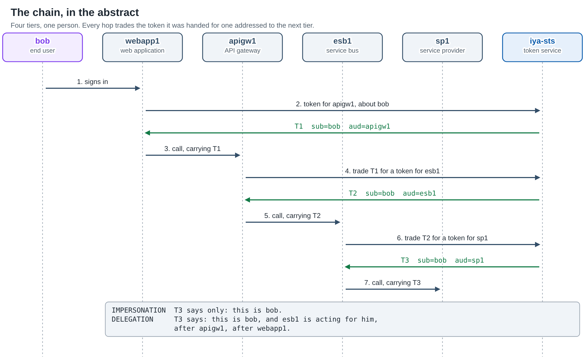
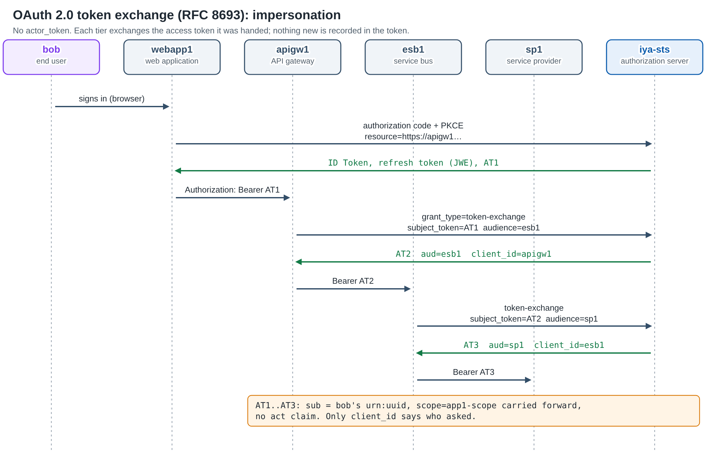
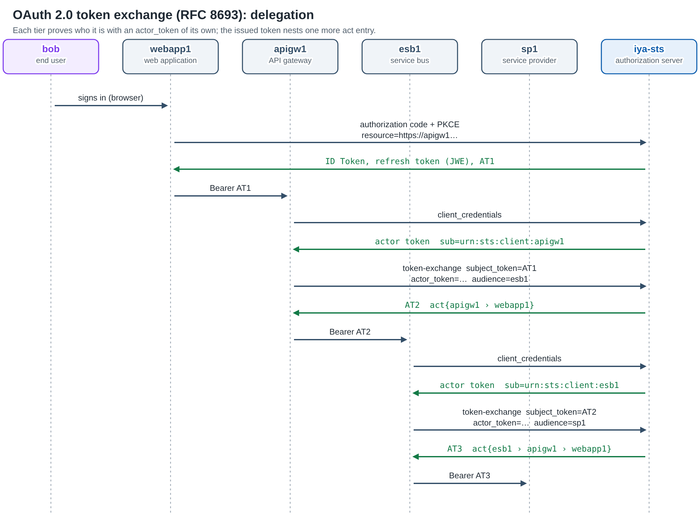
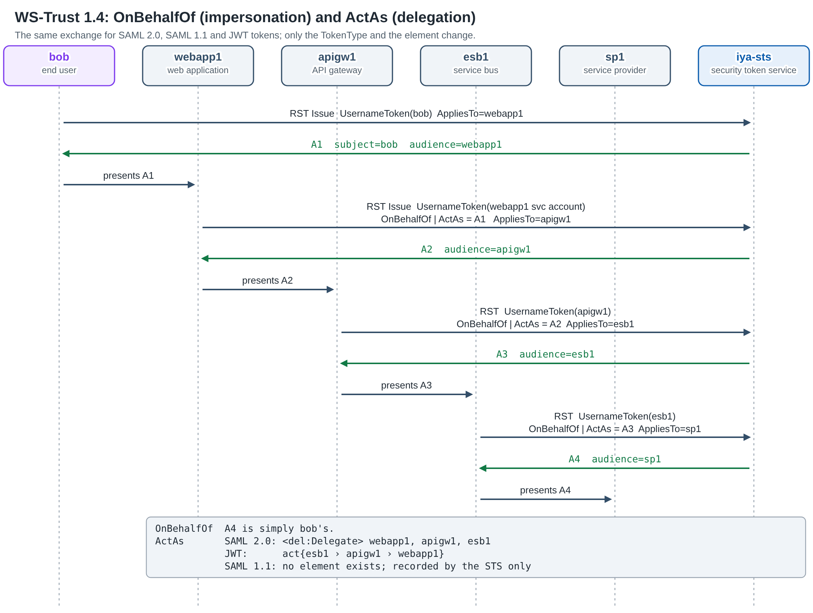
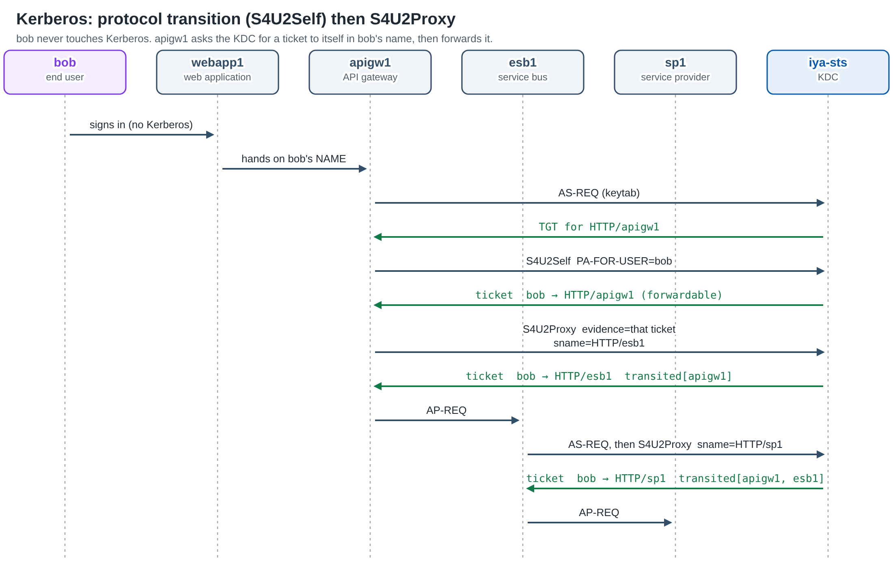
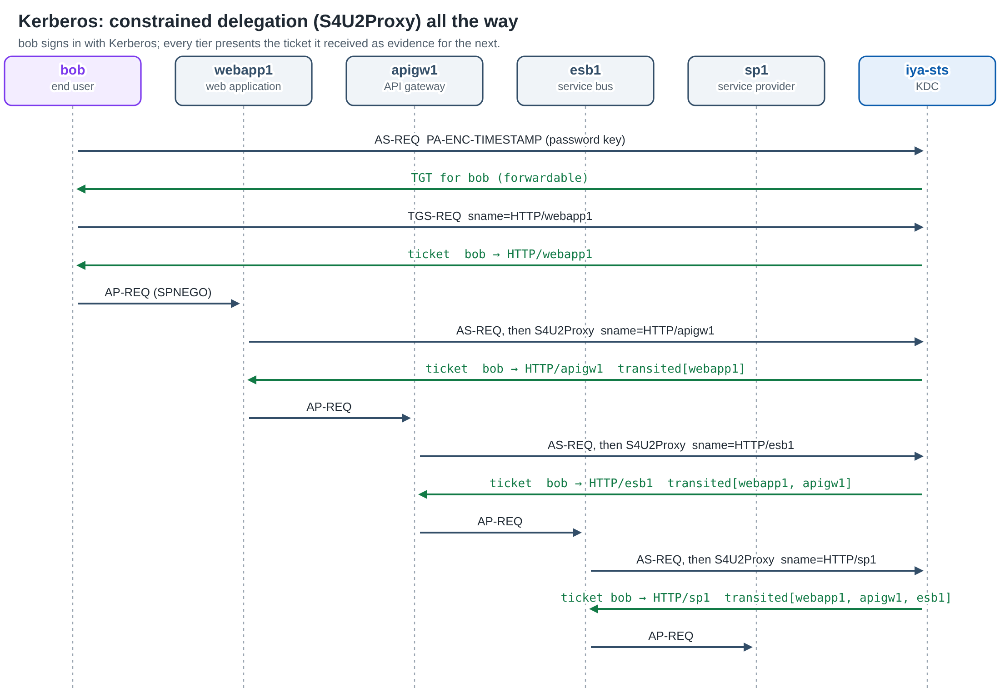
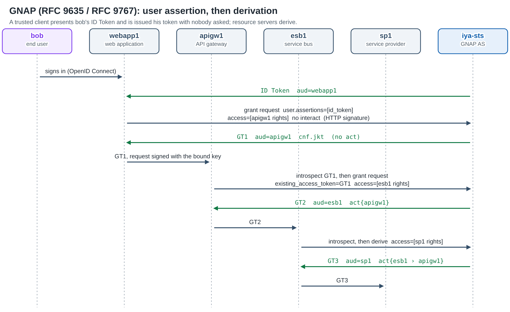
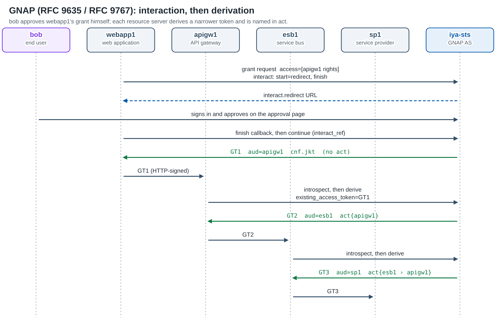
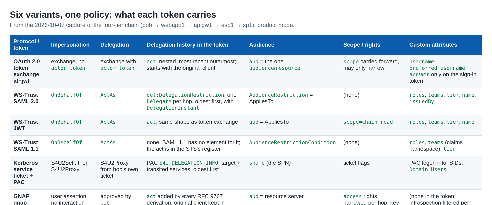

# One Policy, Four Protocols: Delegation and Impersonation in iya-sts

*How a single directory configuration governs OAuth 2.0 Token Exchange, WS-Trust, Kerberos S4U and GNAP, shown with the real tokens from a four-tier chain.*

---

Every enterprise has a request path like this one. A person signs in to a web application. The web application calls an API gateway. The gateway calls an enterprise service bus, and the bus calls the system of record. Four tiers, one person. Each tier needs a credential addressed to the next tier, and the last one needs to know **whose request it is**. Often it also needs to know **who handled the request on the way**.

There are two well-known answers:

**Impersonation.** The downstream token is simply the user's. The service provider sees "this is bob" and nothing else.

**Delegation.** The downstream token is still about the user, but it also names the parties acting for him: "this is bob, and esb1 is acting for him, after apigw1, after webapp1."

Each of the major token protocols has its own way of asking for one or the other. OAuth 2.0 has RFC 8693 token exchange with its `act` claim. WS-Trust has `OnBehalfOf` and `ActAs`. Kerberos has Microsoft's S4U2Self and S4U2Proxy extensions. GNAP has user assertions and RFC 9767 token derivation. **None of these specifications says who is allowed to do it.** RFC 8693 leaves it to "the policy of the authorization server". WS-Trust only describes what a requester *asks for*. Active Directory's answer for Kerberos is a handful of account attributes.

iya-sts answers that question **once, for all four protocols**: the same attributes on the same directory entries, the same questions put to the same XACML issuance policy, and the same audit record of every act, issued or refused.

This page walks through that model. Then, protocol by protocol, it shows the actual tokens iya-sts issued along a four-tier chain. They were captured from our end-to-end test suite on October 7, 2026, with the service running in **product mode** (every check enforced).

---

## The cast

Every scenario on this page uses the same five parties and one token service:

**bob**: the end user.

**webapp1**: the web application bob signs in to.

**apigw1**: an API gateway that webapp1 calls.

**esb1**: an enterprise service bus behind the gateway.

**sp1**: the service provider at the end of the chain.

**iya-sts**: the token service. Depending on the protocol it plays the OAuth authorization server, the WS-Trust STS, the Kerberos KDC or the GNAP authorization server, all from **one process and one directory**.



At every hop, the tier holding a token for itself goes back to iya-sts and asks for a token about the same person, addressed to the next tier. Whether the new token records *who asked* is the difference between impersonation and delegation.

The captured chains used distinct directory entries per scenario. That is why the names in the tokens below carry suffixes such as `bob_end_user-wsdel` or `apigw1-gnimp`. Each of the twelve runs (six protocol variants × two semantics) created its own copy of the cast so that the runs could not interfere with each other.

---

## One configuration for every protocol

Every delegation act, whatever the protocol, is reduced to the same **four parties**:

**Subject**: who the new token is about (bob).

**Actor**: who is asking (for example apigw1).

**S (source)**: the application the subject's current token was issued *for*.

**R (target)**: the application the new token will be *for*.

Each protocol finds these four in its own message. In OAuth they are the `subject_token`, the `actor_token` (or the authenticated client), the subject token's `aud`, and the requested `audience`. In WS-Trust they are the token inside `OnBehalfOf`/`ActAs`, the requester, that token's `Audience`, and the `AppliesTo`. In Kerberos they are the user in `PA-FOR-USER` or the client of the evidence ticket, the requesting service, the service the evidence ticket was issued for, and the service named in the TGS-REQ. In GNAP they are the person in the user assertion or the original token, the client or deriving resource server, and the resource servers the requested access rights resolve to.

All four parties are **entries in the directory**, so the rules live on those entries. Those rules are a deliberate echo of Active Directory's:

**`appAllowedToDelegateTo`** (on S): the applications S may hand a subject on to. This is the analogue of `msDS-AllowedToDelegateTo`.

**`appAllowedToActOnBehalfOf`** (on R): resource-based delegation, set by the target's owner. This is the analogue of `msDS-AllowedToActOnBehalfOfOtherIdentity`.

**`appDelegationSemantics`** (on the actor): whether it may use `delegation`, `impersonation` or both. Empty means delegation only. Allowing impersonation plays the role of `TRUSTED_TO_AUTHENTICATE_FOR_DELEGATION`.

**`appDelegationSubjectGroup`** (on the actor): the groups whose members it may act for.

**`stsNotDelegated` / `appNotDelegated`**, plus the realm's `delegation.protectedGroups`: never act for this subject. This is AD's *Protected Users*.

**`stsMayAct`**: a person names one delegate. Their tokens then carry RFC 8693's `may_act` claim, and a mismatch is refused in every mode.

There are **no per-protocol copies** of these settings. An application that is used over OAuth, WS-Trust, Kerberos and GNAP has one entry, and the same `appAllowedToDelegateTo` governs all four.

**How a request picks its semantics** is also shared. The request asks first, through the protocol's own vocabulary. In RFC 8693 that is the `exchange_semantics` extension parameter, or simply whether an `actor_token` is present. In WS-Trust, `ActAs` asks for delegation and `OnBehalfOf` for impersonation. In Kerberos, S4U2Self is impersonation and S4U2Proxy is delegation. In GNAP, a user assertion is impersonation and a derivation is delegation. Without such a signal, the actor's default applies, then the subject's, then the realm's (which is `delegation` unless set). A request may only use semantics that **both** the actor and the subject allow.

**How a request is decided** is one ordered list of refusals in the issuance policy: a `may_act` naming someone else, more than one target, an unregistered target, a protected subject, an unknown actor, disallowed semantics, a subject outside the actor's groups, a subject lacking the target's required role, and finally the relationship itself (S must delegate to R, or R must accept the actor). Because these are rules in an XACML policy, a realm can add its own Deny rules, and they apply to all four protocols at once.

In **product mode** a failed check is a refusal, spoken in each protocol's own error vocabulary: `invalid_target` or `invalid_request` in OAuth, a `wst:RequestFailed` SOAP fault in WS-Trust, `KDC_ERR_BADOPTION` or `KDC_ERR_POLICY` in Kerberos, and `request_denied` in GNAP. In **development mode** the same questions are asked, but the token is issued anyway and the act is marked *"WOULD HAVE BEEN REFUSED in product"*. A client under test keeps working, and the operator can see what would break.

---

## 1. OAuth 2.0 Token Exchange (RFC 8693)

### Impersonation



bob signs in to webapp1 with the authorization code flow and PKCE. webapp1 asks for an access token with `resource=https://apigw1-imp.example.com`. From then on, each tier sends `grant_type=urn:ietf:params:oauth:grant-type:token-exchange` with the token it was handed as the `subject_token` and the next tier as the `audience`. No `actor_token` is sent.

**The sign-in: ID Token for webapp1**

```json
{
  "iss": "https://localhost:8081",
  "sub": "urn:uuid:4c152d8c-121f-443e-a678-8598b426d658",
  "aud": "webapp1-imp",
  "azp": "webapp1-imp",
  "amr": ["pwd"],
  "acr": "1",
  "sid": "KmLFWriPtSBDcYtZH5P3fvJ0Ka5ymXjI",
  "session_expiry": 1791342013,
  "tenant": "default",
  "at_hash": "oYrt__FslSZS4Dy_3v-75g"
}
```

A refresh token is issued alongside it. It is a JWE (`RSA-OAEP-256` / `A256GCM`), opaque to the client, and presented only to the token endpoint.

**AT1: the access token webapp1 presents to apigw1** (header `typ: at+jwt`, RS256)

```json
{
  "iss": "https://localhost:8081",
  "sub": "urn:uuid:4c152d8c-121f-443e-a678-8598b426d658",
  "aud": "https://apigw1-imp.example.com",
  "client_id": "webapp1-imp",
  "scope": "app1-scope",
  "username": "bob_end_user-imp",
  "preferred_username": "bob_end_user-imp",
  "auth_time": 1791338413,
  "amr": ["pwd"],
  "acr": "1",
  "status": { "status_list": {
    "idx": 686489,
    "uri": "https://localhost:8081/status-lists/access-tokens" } }
}
```

**AT3: the token esb1 presents to sp1, after two exchanges**

```json
{
  "iss": "https://localhost:8081",
  "sub": "urn:uuid:4c152d8c-121f-443e-a678-8598b426d658",
  "aud": "https://sp1-imp.example.com",
  "client_id": "esb1-imp",
  "scope": "app1-scope",
  "username": "bob_end_user-imp",
  "preferred_username": "bob_end_user-imp",
  "status": { "status_list": {
    "idx": 861517,
    "uri": "https://localhost:8081/status-lists/access-tokens" } }
}
```

**What to notice:**

**No `act` claim anywhere.** sp1 sees bob. Only `client_id` reveals which tier asked last, and nothing reveals the tiers before it.

**`aud` is exactly one resource server per hop**, as RFC 9068 requires. An exchange naming two audiences is refused.

**`scope` is carried forward** (`app1-scope`) because the exchange named none. The policy lets scope narrow at an exchange but never widen.

**The authentication facts (`auth_time`, `amr`, `acr`) stay on the sign-in token.** An exchanged token is not a fresh authentication, so it does not claim to be one.

**Every access token has a status-list entry** (the IETF Token Status List), so any token in the chain can be revoked individually.

### Delegation



The delegation chain differs in one step: before each exchange, the tier obtains a token **about itself** with `client_credentials` and sends it as the `actor_token`.

**The actor token apigw1 obtains for itself**

```json
{
  "iss": "https://localhost:8081",
  "sub": "urn:sts:client:apigw1-del",
  "aud": "https://localhost:8081/resource",
  "client_id": "apigw1-del",
  "scope": "app1-scope"
}
```

**AT2: what apigw1 receives for esb1**

```json
{
  "iss": "https://localhost:8081",
  "sub": "urn:uuid:b58f3aa3-7bd0-4116-99b1-996cf6aef648",
  "aud": "https://esb1-del.example.com",
  "client_id": "apigw1-del",
  "scope": "app1-scope",
  "username": "bob_end_user-del",
  "act": {
    "sub": "urn:sts:client:apigw1-del",
    "iss": "https://localhost:8081",
    "act": {
      "sub": "urn:sts:client:webapp1-del",
      "iss": "https://localhost:8081"
    }
  }
}
```

**AT3: what sp1 receives**

```json
{
  "iss": "https://localhost:8081",
  "sub": "urn:uuid:b58f3aa3-7bd0-4116-99b1-996cf6aef648",
  "aud": "https://sp1-del.example.com",
  "client_id": "esb1-del",
  "scope": "app1-scope",
  "username": "bob_end_user-del",
  "preferred_username": "bob_end_user-del",
  "act": {
    "sub": "urn:sts:client:esb1-del",
    "iss": "https://localhost:8081",
    "act": {
      "sub": "urn:sts:client:apigw1-del",
      "iss": "https://localhost:8081",
      "act": {
        "sub": "urn:sts:client:webapp1-del",
        "iss": "https://localhost:8081"
      }
    }
  }
}
```

**What to notice:**

**The `act` chain nests, most recent outermost**, exactly as RFC 8693 section 4.1 describes. Only the outermost `act` is the *current* actor; the nested ones are history.

**The chain starts with the original client.** webapp1 never performed an exchange. iya-sts adds it at the first exchange because AT1's `client_id` names it, so sp1 sees the whole path from the browser sign-in onwards.

**Every `act` entry carries `iss`**, as the token-chaining profile requires, so a chain that crosses issuers stays unambiguous.

**Clients are named `urn:sts:client:<id>`** in RFC 9700 mode (implied by product mode), so an application acting can never be confused with a person whose `sub` is a `urn:uuid`.

**`/oauth2/introspect` returns the same nested `act`** (and any `may_act`), so a resource server that does not validate JWTs locally sees the same history.

---

## 2. WS-Trust: OnBehalfOf and ActAs



WS-Trust gets the same chain three times, once per token type, because iya-sts issues **SAML 2.0, SAML 1.1 and JWT** tokens from the same RequestSecurityToken. bob's client obtains a token for webapp1 with his `UsernameToken`. Each tier then sends an RST, authenticated with its own service account's `UsernameToken`, that carries the token it received inside `<wst:OnBehalfOf>` (impersonation) or `<wst14:ActAs>` (delegation), with the next tier as `AppliesTo`.

Two things are shared by all three token types:

**The issuer is per application.** Each assertion's `Issuer` is the entityID the *AppliesTo* application's own metadata names (`urn:sts:idp:apigw1-wsdel`, and so on), the same value `/saml2/metadata/<app>` and `/wsfed/metadata/<app>` publish.

**The attributes are the subject's, shaped by the target's configuration.** A delegated token carries bob's groups, roles and claims and nothing of the requester's. Which attributes appear, and how they are named, comes from the AppliesTo application's entry.

### SAML 2.0 with ActAs: the Delegation Restriction condition

This is the final assertion, issued to esb1 for sp1, signature elided:

```xml
<saml:Assertion ID="_6dfb0b466ed99261a07530ec2ffba6c8" Version="2.0"
    IssueInstant="2026-10-07T02:00:25.221Z">
  <saml:Issuer>urn:sts:idp:sp1-wsdel</saml:Issuer>
  <ds:Signature>… RSA-SHA256, exc-c14n …</ds:Signature>
  <saml:Subject>
    <saml:NameID Format="urn:oasis:names:tc:SAML:1.1:nameid-format:unspecified">
      bob_end_user-wsdel</saml:NameID>
    <saml:SubjectConfirmation Method="urn:oasis:names:tc:SAML:2.0:cm:bearer"/>
  </saml:Subject>
  <saml:Conditions NotBefore="2026-10-07T02:00:25.221Z"
                   NotOnOrAfter="2026-10-07T03:00:25.221Z">
    <saml:Condition xsi:type="del:DelegationRestrictionType">
      <del:Delegate DelegationInstant="2026-10-07T02:00:24.956Z">
        <saml:NameID Format="urn:oasis:names:tc:SAML:2.0:nameid-format:entity">
          webapp1-wsdel</saml:NameID>
      </del:Delegate>
      <del:Delegate DelegationInstant="2026-10-07T02:00:25.096Z">
        <saml:NameID Format="urn:oasis:names:tc:SAML:2.0:nameid-format:entity">
          apigw1-wsdel</saml:NameID>
      </del:Delegate>
      <del:Delegate DelegationInstant="2026-10-07T02:00:25.221Z">
        <saml:NameID Format="urn:oasis:names:tc:SAML:2.0:nameid-format:entity">
          esb1-wsdel</saml:NameID>
      </del:Delegate>
    </saml:Condition>
    <saml:AudienceRestriction>
      <saml:Audience>https://sp1-wsdel.example.com</saml:Audience>
    </saml:AudienceRestriction>
  </saml:Conditions>
  <saml:AuthnStatement AuthnInstant="2026-10-07T02:00:25.221Z">
    <saml:AuthnContext><saml:AuthnContextClassRef>
      urn:oasis:names:tc:SAML:2.0:ac:classes:unspecified
    </saml:AuthnContextClassRef></saml:AuthnContext>
  </saml:AuthnStatement>
  <saml:AttributeStatement>
    <saml:Attribute Name="name"><saml:AttributeValue>bob_end_user-wsdel</saml:AttributeValue></saml:Attribute>
    <saml:Attribute Name="issuedBy"><saml:AttributeValue>urn:sts:idp:sp1-wsdel</saml:AttributeValue></saml:Attribute>
    <saml:Attribute Name="roles"><saml:AttributeValue>chain-wsdel-role</saml:AttributeValue></saml:Attribute>
    <saml:Attribute Name="teams"><saml:AttributeValue>chain-wsdel-team</saml:AttributeValue></saml:Attribute>
    <saml:Attribute Name="tier"
        NameFormat="urn:oasis:names:tc:SAML:2.0:attrname-format:basic">
      <saml:AttributeValue>gold-bob_end_user-wsdel</saml:AttributeValue>
    </saml:Attribute>
  </saml:AttributeStatement>
</saml:Assertion>
```

**What to notice:**

**The history is the OASIS *SAML V2.0 Condition for Delegation Restriction***, with one `del:Delegate` per hop. Unlike OAuth's `act`, it is ordered **oldest first**, as that profile specifies, and each entry carries the **`DelegationInstant`** at which that party acted. Each delegate is an application, named in the `entity` NameID format.

**Impersonation (`OnBehalfOf`) produces the same assertion without the condition.** `DelegationRestriction` was absent at every hop of the impersonation run.

**The authentication context degrades honestly.** bob's first assertion says `PasswordProtectedTransport`, because he presented a password over TLS. Every downstream assertion says `unspecified`, because the requester authenticated, not bob.

**The custom attributes** `roles`, `teams` and `tier` come from the AppliesTo application's configuration. `tier` shows a per-attribute `NameFormat` (`basic`), and its value was computed from the subject (`gold-<username>`).

### JWT with ActAs: the same history as OAuth

When the RST asks for `TokenType` `urn:ietf:params:oauth:token-type:jwt`, the STS returns an `at+jwt` access token inside a `wsse:BinarySecurityToken`. Its delegation history has **exactly the shape a token exchange writes**:

```json
{
  "iss": "https://localhost:8081",
  "sub": "urn:uuid:218c2abd-bd1b-447c-856b-d41533170e33",
  "aud": "https://sp1-wjdel.example.com",
  "client_id": "esb1-wjdel",
  "scope": "chain.read",
  "name": "bob_end_user-wjdel",
  "roles": ["chain-wjdel-role"],
  "teams": ["chain-wjdel-team"],
  "tier": "gold-bob_end_user-wjdel",
  "act": {
    "sub": "urn:sts:client:esb1-wjdel",
    "iss": "https://localhost:8081",
    "act": {
      "sub": "urn:sts:client:apigw1-wjdel",
      "iss": "https://localhost:8081",
      "act": {
        "sub": "urn:sts:client:webapp1-wjdel",
        "iss": "https://localhost:8081"
      }
    }
  }
}
```

**What to notice:**

**A resource server that already understands RFC 8693 `act` needs nothing new** to read a WS-Trust delegation chain. A SOAP front end and a REST back end can share one validation library.

**`client_id` is the WS-Trust requester**, and `scope` (`chain.read`) comes from the AppliesTo application, as do the same `roles`/`teams`/`tier` custom claims the SAML 2.0 variant carries as attributes.

**With `OnBehalfOf` the JWT is identical minus `act`.** The impersonation run's final token named only bob, with `client_id=esb1-wjimp`.

### SAML 1.1 with ActAs: where the format runs out

The SAML 1.1 variant is the one case where the format cannot carry what the policy decided:

```xml
<saml:Assertion MajorVersion="1" MinorVersion="1"
    AssertionID="_524d423c7f8066d02ac3f115cccf5276"
    Issuer="urn:sts:idp:sp1-w11del" IssueInstant="2026-10-07T02:00:42.069Z">
  <saml:Conditions NotBefore="2026-10-07T02:00:42.069Z"
                   NotOnOrAfter="2026-10-07T03:00:42.069Z">
    <saml:AudienceRestrictionCondition>
      <saml:Audience>https://sp1-w11del.example.com</saml:Audience>
    </saml:AudienceRestrictionCondition>
  </saml:Conditions>
  <saml:AuthenticationStatement
      AuthenticationMethod="urn:oasis:names:tc:SAML:1.0:am:unspecified"
      AuthenticationInstant="2026-10-07T02:00:42.069Z">
    <saml:Subject>
      <saml:NameIdentifier>bob_end_user-w11del</saml:NameIdentifier>
      <saml:SubjectConfirmation><saml:ConfirmationMethod>
        urn:oasis:names:tc:SAML:1.0:cm:bearer
      </saml:ConfirmationMethod></saml:SubjectConfirmation>
    </saml:Subject>
  </saml:AuthenticationStatement>
  <saml:AttributeStatement>
    <saml:Subject>…bob_end_user-w11del…</saml:Subject>
    <saml:Attribute AttributeName="roles"
        AttributeNamespace="http://schemas.xmlsoap.org/ws/2005/05/identity/claims">
      <saml:AttributeValue>chain-w11del-role</saml:AttributeValue></saml:Attribute>
    <saml:Attribute AttributeName="teams"
        AttributeNamespace="http://schemas.xmlsoap.org/ws/2005/05/identity/claims">
      <saml:AttributeValue>chain-w11del-team</saml:AttributeValue></saml:Attribute>
    <saml:Attribute AttributeName="tier" AttributeNamespace="urn:example:chain">
      <saml:AttributeValue>gold-bob_end_user-w11del</saml:AttributeValue></saml:Attribute>
  </saml:AttributeStatement>
  <ds:Signature>…</ds:Signature>
</saml:Assertion>
```

**What to notice:**

**There is no delegate in it, by necessity.** The Delegation Restriction condition is a SAML 2.0 condition type and cannot appear in a 1.1 assertion. SAML 1.1 defines no element of its own for "this party acted", and WS-Trust 1.4 asks an `ActAs` token to carry the identity acted *as*, not the requester. So the assertion is about bob and names nobody else.

**The decision was still made.** The same policy evaluated every hop as a delegation, and Monitoring → Delegation in iya-sts records each hop as a `wstrust-actas` act, with a note that SAML 1.1 cannot name who acted. **If your relying party needs to see the chain, ask for SAML 2.0 or JWT.**

**SAML 1.1's attribute model shows through.** The attributes use `AttributeNamespace` (the WS-* identity claims namespace for `roles`/`teams`, a custom one for `tier`), and the authentication method degrades from `am:password` at sign-in to `am:unspecified` downstream, mirroring the SAML 2.0 variant.

---

## 3. Kerberos: S4U2Self and S4U2Proxy

Kerberos service accounts are ordinary applications in iya-sts's directory: the entry whose identifier is the service's `SPN@REALM`. The KDC reads the **same** `appAllowedToDelegateTo`, `appAllowedToActOnBehalfOf` and `appDelegationSemantics` attributes as the OAuth server. There is no second set of rules kept by the KDC.

### Impersonation: protocol transition



bob signs in to webapp1 **without Kerberos**, for example with a form. webapp1 hands his name to apigw1. apigw1 gets its own TGT from its keytab, then uses **S4U2Self** (`PA-FOR-USER`) to obtain a service ticket *to itself* in bob's name. That ticket becomes the evidence for **S4U2Proxy**, which yields a ticket for esb1. esb1 does the same towards sp1.

**The S4U2Self ticket (bob → HTTP/apigw1), decrypted with the service key**

```json
{
  "client": "bob_end_user-krbimp@EXAMPLE.COM",
  "server": "HTTP/apigw1-krbimp.example.com@EXAMPLE.COM",
  "flags": ["forwardable", "renewable", "pre-authent", "enc-pa-rep"],
  "endtime": "2026-10-07T10:00:43.000Z",
  "renewTill": "2026-10-14T02:00:43.000Z",
  "pac": {
    "logonInfo": {
      "effectiveName": "bob_end_user-krbimp",
      "logonDomainName": "EXAMPLE",
      "userSid": "S-1-5-21-1004336348-1177238915-682003330-893108296",
      "groups": [{ "relativeId": 513, "name": "Domain Users" }],
      "extraSids": [
        { "text": "S-1-18-1",
          "name": "Authentication authority asserted identity" },
        { "text": "S-1-5-11",
          "name": "NT AUTHORITY\\Authenticated Users" }
      ]
    },
    "delegationInfo": null
  }
}
```

**The S4U2Proxy ticket esb1 presents to sp1**

```json
{
  "client": "bob_end_user-krbimp@EXAMPLE.COM",
  "server": "HTTP/sp1-krbimp.example.com@EXAMPLE.COM",
  "flags": ["forwardable", "renewable", "pre-authent", "enc-pa-rep"],
  "pac": {
    "logonInfo": { "effectiveName": "bob_end_user-krbimp", "…": "…" },
    "delegationInfo": {
      "s4u2proxyTarget": "HTTP/sp1-krbimp.example.com",
      "transitedServices": [
        "HTTP/apigw1-krbimp.example.com@EXAMPLE.COM",
        "HTTP/esb1-krbimp.example.com@EXAMPLE.COM"
      ]
    }
  }
}
```

**What to notice:**

**The ticket is `forwardable` only because policy allowed it.** S4U2Self is never refused (a ticket to yourself is not the privilege), but its ticket is forwardable only when the service may impersonate (`appDelegationSemantics` includes `impersonation`) and bob is not protected. Without that flag, the S4U2Proxy that follows fails.

**The PAC carries Windows-shaped identity**: a SID for bob, `Domain Users`, and the well-known `S-1-18-1` *Authentication authority asserted identity* SID. The KDC is iya-sts, but a Windows-style acceptor reads a familiar PAC.

**Kerberos cannot pretend.** In Kerberos, impersonation is only the *first* step. Every S4U2Proxy writes [MS-PAC] `S4U_DELEGATION_INFO`, so the final ticket records `apigw1 › esb1` in `transitedServices`, **oldest first**. This is why iya-sts's delegation register files this chain as one impersonation act followed by delegation acts, while an OAuth impersonation chain is impersonation at every hop.

### Delegation: constrained delegation end to end



Here bob uses Kerberos himself: an AS-REQ with `PA-ENC-TIMESTAMP` under his password key, a TGS-REQ for `HTTP/webapp1`, and an AP-REQ to webapp1. webapp1 then presents bob's own ticket as S4U2Proxy evidence, and so on down the chain.

**The ticket sp1 receives**

```json
{
  "client": "bob_end_user-krbdel@EXAMPLE.COM",
  "server": "HTTP/sp1-krbdel.example.com@EXAMPLE.COM",
  "flags": ["forwardable", "renewable", "pre-authent", "enc-pa-rep"],
  "pac": {
    "logonInfo": { "effectiveName": "bob_end_user-krbdel", "…": "…" },
    "delegationInfo": {
      "s4u2proxyTarget": "HTTP/sp1-krbdel.example.com",
      "transitedServices": [
        "HTTP/webapp1-krbdel.example.com@EXAMPLE.COM",
        "HTTP/apigw1-krbdel.example.com@EXAMPLE.COM",
        "HTTP/esb1-krbdel.example.com@EXAMPLE.COM"
      ]
    }
  }
}
```

**What to notice:**

**`transitedServices` lists all three intermediaries**, each with its realm and oldest first. This is the same information as SAML 2.0's `del:Delegate` list, in the same order.

**The "audience" is the ticket itself.** A service ticket is encrypted in the target's long-term key, so `sname` *is* the audience restriction, enforced cryptographically.

**The evidence is not taken on trust.** Because a front end could set the forwardable flag on a ticket encrypted in its own key (CVE-2020-17049, "Bronze Bit"), the KDC verifies the PAC's ticket signature and KDC signature on every evidence ticket, and refuses evidence without a PAC.

**Classic and resource-based constrained delegation are both the shared attributes.** Classic delegation is the front end's `appAllowedToDelegateTo`. RBCD (requested with the `PA-PAC-OPTIONS` bit) is the back end's `appAllowedToActOnBehalfOf`.

---

## 4. GNAP (RFC 9635) with Token Derivation (RFC 9767)

GNAP is the newest of the four. Its tokens are bound to keys, its requests are signed with HTTP Message Signatures, and its "scopes" are structured **access rights**. iya-sts maps it onto the same model as the others.

### Impersonation: a trusted client with a user assertion



webapp1 is marked `gnapSkipInteraction`. After bob signs in with OpenID Connect, webapp1 sends a grant request with bob's ID Token in `user.assertions` and **no interaction**, and is issued a token about bob for apigw1. This is the S4U2Self shape. apigw1 and esb1 then **derive** downstream tokens (RFC 9767 section 4) by presenting the token they were handed as `existing_access_token`.

**GT1: what webapp1 presents to apigw1** (header `typ: gnap-at+jwt`)

```json
{
  "typ": "GNAP",
  "iss": "https://localhost:8081/gnap",
  "sub": "urn:uuid:2c9f12d3-140f-4f51-b579-1bd664c62280",
  "aud": "apigw1-gnimp",
  "client_id": "webapp1-gnimp",
  "grant_id": "uxszxMqWIZ4m_8IMd1rBYqRl",
  "access": [
    { "type": "https://apigw1-gnimp.example.com/access",
      "actions": ["read"] },
    { "type": "https://app1-gnimp.example.com/app1",
      "actions": ["read"],
      "locations": ["https://apigw1-gnimp.example.com/api"] }
  ],
  "cnf": { "jkt": "SK4tcu86MhUpod2pHVMg-1KKD5AZVErRLv78LE_7Q_g" },
  "status": { "status_list": {
    "idx": 693989,
    "uri": "https://localhost:8081/status-lists/access-tokens" } }
}
```

**GT3: what sp1 receives after two derivations**

```json
{
  "typ": "GNAP",
  "iss": "https://localhost:8081/gnap",
  "sub": "urn:uuid:2c9f12d3-140f-4f51-b579-1bd664c62280",
  "aud": "sp1-gnimp",
  "client_id": "esb1-gnimp",
  "grant_id": "uxszxMqWIZ4m_8IMd1rBYqRl",
  "access": [
    { "type": "https://sp1-gnimp.example.com/access",
      "actions": ["read"] },
    { "type": "https://app1-gnimp.example.com/app1",
      "actions": ["read"],
      "locations": ["https://sp1-gnimp.example.com/api"] }
  ],
  "cnf": { "jkt": "…esb1's key thumbprint…" },
  "act": { "sub": "esb1-gnimp", "act": { "sub": "apigw1-gnimp" } }
}
```

### Delegation: bob approves the grant



In the delegation run, webapp1 is an ordinary client. Its grant request asks for interaction, and bob signs in and **approves it himself** on the approval page. The derivations that follow are identical. The final token's history reads `act: { sub: "esb1-gndel", act: { sub: "apigw1-gndel" } }`.

**What to notice:**

**In GNAP, derivation is always delegation.** The user-assertion step is impersonation (GT1 has no `act`), but every RFC 9767 derivation adds the deriving resource server to `act`, in every token format iya-sts can issue for GNAP, up to `gnap.maxDerivationDepth`. That is why the *impersonation* run still ends with a two-entry chain, just as Kerberos's protocol transition is followed by S4U2Proxy.

**The original client is not in `act`.** `act` names only the parties that *acted on a token*, and `client_id` becomes the deriving tier. GNAP keeps webapp1 in the **grant** instead: every token in the chain carries the original `grant_id`, and that grant names webapp1 as its client and bob as its resource owner. Compare OAuth token exchange, which puts the original client at the bottom of `act`.

**Actors are bare identifiers** (`apigw1-gnimp`), the GNAP instance identifiers, rather than OAuth's `urn:sts:client:` form.

**Access rights narrow at every hop and never widen.** apigw1's rights are for apigw1. The derived token for esb1 carries esb1's own access type and the common `app1` right relocated to esb1's API. A derived token can never carry more access than the token it came from, in any mode.

**Every token is key-bound.** `cnf.jkt` is the thumbprint of the presenting party's key, a *different* key at each hop, and every request is signed with HTTP Message Signatures. A stolen GT2 is useless without apigw1's private key.

**Introspection is filtered per resource server.** When esb1 introspected GT2, the response listed only the access right relevant to esb1. When sp1 introspected GT3, it saw both of its own rights. Each tier learns only what it needs.

---

## Side by side



A few observations from the comparison:

**There are three families of history encoding.** JSON-nested `act`, most recent outermost, is used by OAuth, WS-Trust JWT and GNAP. A flat, oldest-first list is used by SAML 2.0's `del:Delegate` and Kerberos's `transitedServices`. SAML 1.1 has no encoding at all. A consumer that normalises all of them to "subject plus ordered list of actors" sees the same chain from every protocol.

**Who counts as the first actor differs by design.** OAuth includes the original client at the bottom of `act`. WS-Trust and Kerberos start the list with the first tier that *requested* on bob's behalf (webapp1). GNAP starts with the first *deriving* resource server and keeps the original client in the grant.

**Audience is always exactly one target**, whether it is called `aud`, `AudienceRestriction`, `AppliesTo` or `sname`. The policy refuses a token for two targets in every protocol.

**Custom attributes follow the target's configuration** in the token formats designed to carry them (SAML, WS-Trust JWT). In OAuth and GNAP access tokens they appear only where the client or resource server is configured for them, and the PAC carries the Windows view of the same person.

---

## Watching it

Every act from every protocol, issued or refused, lands in one place: **Monitoring → Delegation** in the iya-sts console. It shows the four parties, the semantics, the token consumed and the token produced, and the sentence from the issuance policy that allowed or refused it. In development mode, a refused act reads *WOULD HAVE BEEN REFUSED*.

The **delegation map** draws the same acts as a diagram, one box per party, with chains across protocols joined where they share an application. Configure webapp1, apigw1, esb1 and sp1 once, run the OAuth, WS-Trust, Kerberos and GNAP chains through them, and the map shows one path, because it *is* one path, under one policy.

The same data is available to automation at `GET /admin-api/delegation`, `GET /admin-api/delegation/policy` and the map's `?format=json`.

---

## Summary

Delegation and impersonation have been standardised four times over, in four vocabularies, and each standard deliberately leaves the hard part (*who may act for whom*) to the deployment. iya-sts treats that part as a single, protocol-independent question about four parties, answered by a single XACML policy over attributes on the directory entries you already maintain. The protocols differ in how they **ask** and how they **record**. The decision does not differ.

The tokens on this page are not illustrations: they are what iya-sts issued, in product mode, to the twelve chain jobs in its test suite.

## Related

* [Delegation and impersonation](delegation.md): the reference for every attribute, setting, refusal and console page this walkthrough uses.
* [XACML 3.0 and ALFA](xacml.md): the issuance policy the delegation rules are part of.
* [OAuth 2.0 and OpenID Connect](oauth-oidc.md), [WS-Trust](ws-trust.md), [Kerberos and SPNEGO](kerberos.md) and [GNAP](gnap.md): each protocol on its own.
* [Token samples](token-samples.md): one decoded example of every other kind of token this service issues.
